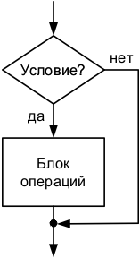
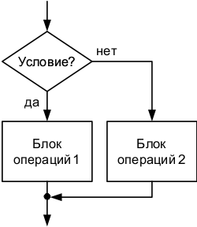

# Условные операторы

Рассмотрим подробнее структуру алгоритма «развилка».

Разветвляющимся называется такой алгоритм, в котором выбирается один из нескольких возможных вариантов вычислительного процесса. Каждый подобный путь называется ветвью алгоритма.

Признаком разветвляющегося алгоритма является наличие операций проверки условия. Чаще всего для проверки условия используется условный оператор if.

Условный оператор if
Условный оператор if может использоваться в форме полной или неполной развилки.

Неполная развилка


if (Условие) 
{
  БлокОпераций1;
}
Неполная развилка
Полная развилка


if (Условие) 
{
  БлокОпераций1;
}
else 
{
  БлокОпераций2;
}


Полная развилка
В случае неполной развилки если Условие истинно, то БлокОпераций1 выполняется, если Условие ложно, то БлокОпераций1 не выполняется.

В случае полной развилки если Условие истинно, то выполняется БлокОпераций1, иначе выполняется БлокОпераций2.

БлокОпераций может состоять из одной операции. В этом случае наличие фигурных скобок, ограничивающих блок, необязательно.

Основными операциями, проверяемыми внутри условного блока, являются операции отношения.


```
#define _CRT_SECURE_NO_WARNINGS // для возможности использования scanf
#include <stdio.h>
int main() 
{
  int k;           // объявляем целую переменную k
  printf("k= ");   // выводим сообщение
  scanf("%d", &k); // вводим переменную k
  if (k >= 5)      // если k>5
    printf("%d >= 5", k); // выводим "ЗНАЧЕНИЕ >= 5"
  else             // иначе
    printf("%d < 5", k);  // выводим "ЗНАЧЕНИЕ < 5"
  getchar(); getchar();
  return 0;
}
```
> k= 3
> 3 < 5


Оператор if может быть вложенным.

```
#define _CRT_SECURE_NO_WARNINGS // для возможности использования scanf
#include <stdio.h>
#include <stdlib.h> // для использования функции system
int main() {
  int key;  // объявляем целую переменную key
  system("chcp 1251"); // переходим в консоли на русский язык
  system("cls");       // очищаем окно консоли
  printf("Введите номер пункта, 1 или 2: ");
  scanf("%d", &key);   // вводим значение переменной key
  if (key == 1)        // если key = 1
    printf("\n Выбран первый пункт"); // выводим сообщение
  else if (key == 2)   // иначе если key = 2
    printf("\n Выбран второй пункт"); // выводим сообщение
  else                 // иначе
    printf("\n Первый и второй пункты не выбраны"); // выводим сообщение
  getchar(); getchar();
  return 0;
}
```

> Введите номер пункта, 1 или 2: 1
> Выбран первый пункт

> Введите номер пункта, 1 или 2: 2
> Выбран второй пункт

> Введите номер пункта, 1 или 2: 3
> Первый и второй пункты не выбраны

При использовании вложенной формы оператора if опция else связывается с последним оператором if.

Если требуется связать опцию else с предыдущим оператором if, внутренний условный оператор заключается в фигурные скобки:
```
#define _CRT_SECURE_NO_WARNINGS // для возможности использования scanf
#include <stdio.h>
#include <stdlib.h> // для использования функции system
int main() 
{
  int key;  // объявляем целую переменную key
  system("chcp 1251"); // переходим в консоли на русский язык
  system("cls");       // очищаем окно консоли
  printf("Введите номер пункта, 1 или 2: ");
  scanf("%d", &key);   // вводим значение переменной key
  if (key != 1) 
  {      // если key не равен 1
    if (key == 2)    // если key равен 2
      printf("\n Выбран второй пункт"); // вывод сообщения
  }              // если key - не 1 и не 2, то ничего не выводится
  else // иначе, если key равен 1
    printf("\n Выбран первый пункт"); // вывод сообщения
  getchar(); getchar();
  return 0;
}
```

> Введите номер пункта, 1 или 2: 1
> Выбран первый пункт

> Введите номер пункта, 1 или 2: 2
> Выбран второй пункт

> Введите номер пункта, 1 или 2: 3


## Логические операции в условных операторах
Условный оператор может проверять
* одновременное выполнение всех условий (операция И — &&)
* выполнение хотя бы одного из условий (операция ИЛИ — ||)
* выполнение только одного из условий (операция исключающее ИЛИ — ^)

Пример: Найти максимум из 3 чисел
```
#define _CRT_SECURE_NO_WARNINGS
#include <stdio.h>
int main()
{
  int a, b, c;
  printf("a=");
  scanf("%d", &a);
  printf("b=");
  scanf("%d", &b);
  printf("c=");
  scanf("%d", &c);
  if ((a >= b) && (a >= c))
    printf("Max = %d", a);
  else if ((b >= a) && (b >= c))
    printf("Max = %d", b);
  else
    printf("Max = %d", c);
  getchar(); 
  getchar();
  return 0;
}
```

Пример на С++: Найти максимум из 3 чисел

```
#include <iostream>
using namespace std;
int main()
{
  int a, b, c;
  cout << "a=";
  cin >> a;
  cout << "b=";
  cin >> b;
  cout << "c=";
  cin >> c;
  if ((a >= b) && (a >= c))
    cout << "Max = " << a;
  else if ((b >= a) && (b >= c))
    cout << "Max = " << b;
  else
    cout << "Max = " << c;
  cin.get(); 
  cin.get();
  return 0;
}
```

Тернарные операции
Тернарная условная операция имеет 3 аргумента и возвращает свой второй или третий операнд в зависимости от значения логического выражения, заданного первым операндом.

Синтаксис тернарной операции в языке Си

 Условие ? Выражение1 : Выражение2;
Если выполняется Условие, то тернарная операция возвращает Выражение1, в противном случае — Выражение2.

Тернарные операции, как и операции условия, могут быть вложенными. Для  разделения вложенных операций используются круглые скобки.

Приведенный выше пример с использованием тернарных операций можно представить в виде


```
#define _CRT_SECURE_NO_WARNINGS // для возможности использования scanf
#include <stdio.h>
#include <stdlib.h> // для использования функции system
int main() 
{
  int key;  // объявляем целую переменную key
  system("chcp 1251"); // переходим в консоли на русский язык
  system("cls");       // очищаем окно консоли
  printf("Введите номер пункта, 1 или 2: ");
  scanf("%d", &key);   // вводим значение переменной key
  key == 1 ? printf("\n Выбран первый пункт") :
    (key == 2 ? printf("\n Выбран второй пункт") :
    printf("\n Первый и второй пункты не выбраны"));
  getchar(); getchar();
  return 0;
}
```

Оператор ветвления switch (оператор множественного выбора)
Оператор if позволяет осуществить выбор только между двумя вариантами. Для того, чтобы производить выбор одного из нескольких вариантов необходимо использовать вложенный оператор if. С этой же целью можно использовать оператор ветвления switch.

Общая форма записи

 


 switch (ЦелоеВыражение)
{
  case Константа1: БлокОпераций1;
    break;
  case Константа2: БлокОпераций2;
    break;
  . . .
  case Константаn: БлокОперацийn;
    break;
  default: БлокОперацийПоУмолчанию;
    break;
}

Оператор ветвления switch выполняется следующим образом:

вычисляется ЦелоеВыражение в скобках оператора switch;
полученное значение сравнивается с метками (Константами) в опциях case, сравнение производится до тех пор, пока не будет найдена метка, соответствующая вычисленному значению целочисленного выражения;
выполняется БлокОпераций соответствующей метки case;
если соответствующая метка не найдена, то выполнится БлокОперацийПоУмолчанию, описанный в опции default.
Альтернатива default может отсутствовать, тогда не будет произведено никаких действий. Опция break; осуществляет выход из оператора switch и переход к следующему за ним оператору. При отсутствии опции break будут выполняться все операторы, начиная с помеченного данной меткой и кончая оператором в опции default.

Константы в опциях case должны быть целого типа (могут быть символами).

