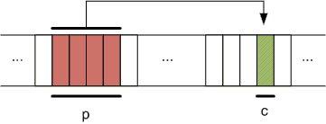
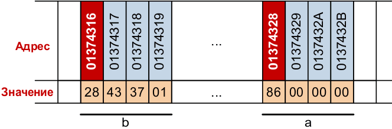

# Указатели

Указатель — переменная, содержащая адрес объекта. Указатель не несет информации о содержимом объекта, а содержит сведения о том, где размещен объект.

Указатели широко используются в программировании на языке Си. Указатели часто используются при работе с массивами.

Память компьютера можно представить в виде последовательности пронумерованных однобайтовых ячеек, с которыми можно работать по отдельности или блоками.

Каждая переменная в памяти имеет

свой адрес — номер первой ячейки, где она расположена;
свое значение.
Указатель — это тоже переменная, которая размещается в памяти. Она тоже имеет адрес, а ее значение является адресом некоторой другой переменной. Переменная, объявленная как указатель, занимает 4 байта в оперативной памяти (в случае 32-битной версии компилятора).

Указатель, как и любая переменная, должен быть объявлен. Общая форма объявления указателя

>тип *ИмяОбъекта;

Тип указателя— это тип переменной, адрес которой он содержит.

Для работы с указателями в Си определены две операции:

операция * (звездочка) — позволяет получить значение объекта по его адресу — определяет значение переменной, которое содержится по адресу, содержащемуся в указателе;
операция & (амперсанд) — позволяет определить адрес переменной.
Например,

 
 
>char c;   // переменная
>char *p; // указатель
>p = &c;  // p = адрес c



Для указанного примера обращение к одним и тем же значениям переменной и адреса представлено в таблице

|          | Переменная | Указатель |
|:--------:|:----------:|:---------:|
|   Адрес  |     &c     |     p     |
| Значение |      c     |     *p    |

Пример:
```
#include <stdio.h>
#include <stdlib.h>
int main()
{
  int a, *b;
  system("chcp 1251");
  system("cls");
  a = 134;
  b = &a;
  // %x = вывод числа в шестнадцатеричной форме
  printf("\n Значение переменной a равно %d = %x шестн.", a,a);
  printf("\n Адрес переменной a равен %x шестн.", &a);
  printf("\n Данные по адресу указателя b равны %d = %x шестн.", *b,*b);
  printf("\n Значение указателя b равно %x шестн.", b);
  printf("\n Адрес расположения указателя b равен %x шестн.", &b);
  getchar();
  return 0;
}
```

```
Значение переменной а равно 134 = 86 шестн.
Адрес переменной а равен 93f7b8 шестн.
Данные по адресу указателя Ь равны 134 = 86 шестн.
Значение указателя Ь равно 93f7b8 шестн.
Адрес расположения указателя Ь равен 93f7ac шестн.
```


Компиляторы высокого уровня поддерживают прямой способ адресации: младший байт хранится в ячейке, имеющей младший адрес.