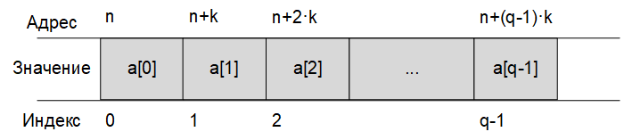
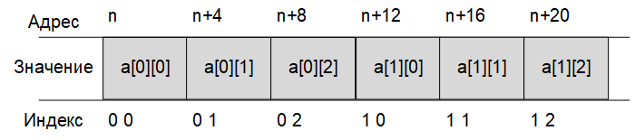

# Статические массивы

При решении задач с большим количеством данных одинакового типа использование переменных с различными именами, не упорядоченных по адресам памяти, затрудняет программирование. В подобных случаях в языке Си используют объекты, называемые массивами.

Массив — это непрерывный участок памяти, содержащий последовательность объектов одинакового типа, обозначаемый одним именем.

Массив характеризуется следующими основными понятиями:

Элемент массива (значение элемента массива) – значение, хранящееся в определенной ячейке памяти, расположенной в пределах массива, а также адрес этой ячейки памяти. Каждый элемент массива характеризуется тремя величинами:

* адресом элемента — адресом начальной ячейки памяти, в которой расположен этот элемент;
* индексом элемента (порядковым номером элемента в массиве);
* значением элемента.

**Адрес массива** – адрес начального элемента массива.
**Имя массива** – идентификатор, используемый для обращения к элементам массива.
**Размер массива** – количество элементов массива
**Размер элемента** – количество байт, занимаемых одним элементом массива.

Графически расположение массива в памяти компьютера можно представить в виде непрерывной ленты адресов.


Представленный на рисунке массив содержит q элементов с индексами от 0 до q-1. Каждый элемент занимает в памяти компьютера k байт, причем расположение элементов в памяти последовательное.

Адреса i-го элемента массива имеет значение **n+k·i**
Адрес массива представляет собой адрес начального (нулевого) элемента массива. Для обращения к элементам массива используется порядковый номер (индекс) элемента, начальное значение которого равно 0. Так, если массив содержит q элементов, то индексы элементов массива меняются в пределах от 0 до q-1.

Длина массива – количество байт, отводимое в памяти для хранения всех элементов массива.

>ДлинаМассива = РазмерЭлемента * КоличествоЭлементов

Для определения размера элемента массива может использоваться функция

> int sizeof(тип);

Например,
>sizeof(char) = 1;
>sizeof(int) = 4;
>sizeof(float) = 4;
>sizeof(double) = 8;

## Объявление и инициализация массивов
Для объявления массива в языке Си используется следующий синтаксис:

>тип имя[размерность]={инициализация};

Инициализация представляет собой набор начальных значений элементов массива, указанных в фигурных скобках, и разделенных запятыми.

> int a[10] = {0, 1, 2, 3, 4, 5, 6, 7, 8, 9};  // массив a из 10 целых чисел

Если количество инициализирующих значений, указанных в фигурных скобках, меньше, чем количество элементов массива, указанное в квадратных скобках, то все оставшиеся элементы в массиве (для которых не хватило инициализирующих значений) будут равны нулю. Это свойство удобно использовать для задания нулевых значений всем элементам массива.

> int b[10] = {0}; // массив b из 10 элементов, инициализированных 0

Если массив проинициализирован при объявлении, то константные начальные значения его элементов указываются через запятую в фигурных скобках. В этом случае количество элементов в квадратных скобках может быть опущено.

> int a[] = {1, 2, 3, 4, 5, 6, 7, 8, 9};

При обращении к элементам массива индекс требуемого элемента указывается в квадратных скобках [].

Пример:
```
#include <stdio.h>
int main() 
{
  int a[] = { 5, 4, 3, 2, 1 }; // массив a содержит 5 элементов
  printf("%d %d %d %d %d\n", a[0], a[1], a[2], a[3], a[4]);
  getchar();
  return 0;
}
```
> 5 4 3 2 1

Однако часто требуется задавать значения элементов массива в процессе выполнения программы. При этом используется объявление массива без инициализации. В таком случае указание количества элементов в квадратных скобках обязательно.

 int a[10];
Для задания начальных значений элементов массива очень часто используется параметрический цикл:


```
#define _CRT_SECURE_NO_WARNINGS
#include <stdio.h>
int main()
{
int a[5]; // объявлен массив a из 5 элементов
int i;
// Ввод элементов массива
for (i = 0; i<5; i++)
{
printf("a[%d] = ", i);
scanf("%d", &a[i]); // &a[i] - адрес i-го элемента массива
}
// Вывод элементов массива
for (i = 0; i<5; i++)
printf("%d ", a[i]); // пробел в формате печати обязателен
getchar(); getchar();
return 0;
}
```
```
а[0] = 7
а[1] = 5
а[2] = 3
а[3] = -1
а[4] = 2
7 5 3 -1 2
```

## Многомерные массивы
В языке Си могут быть также объявлены многомерные массивы. Отличие многомерного массива от одномерного состоит в том, что в одномерном массиве положение элемента определяется одним индексом, а в многомерном — несколькими. Примером многомерного массива является матрица.

Общая форма объявления многомерного массива

> тип имя[размерность1][размерность2]…[размерностьm];
Элементы многомерного массива располагаются в последовательных ячейках оперативной памяти по возрастанию адресов. В памяти компьютера элементы многомерного массива располагаются подряд, например массив, имеющий 2 строки и 3 столбца,

> int a[2][3];
будет расположен в памяти следующим образом


Общее количество элементов в приведенном двумерном массиве определится как

>КоличествоСтрок * КоличествоСтолбцов = 2 * 3 = 6.

Количество байт памяти, требуемых для размещения массива, определится как

>КоличествоЭлементов * РазмерЭлемента = 6 * 4 = 24 байта.

Инициализация многомерных массивов
Значения элементов многомерного массива, как и в одномерном случае, могут быть заданы константными значениями при объявлении, заключенными в фигурные скобки {}. Однако в этом случае указание количества элементов в строках и столбцах должно быть обязательно указано в квадратных скобках [].


Пример:

```
#include <stdio.h>
int main()
{
  int a[2][3] = { 1, 2, 3, 4, 5, 6 };
  printf("%d %d %d\n", a[0][0], a[0][1], a[0][2]);
  printf("%d %d %d\n", a[1][0], a[1][1], a[1][2]);
  getchar();
  return 0;
}
```
>1 2 3
>4 5 6

Однако чаще требуется вводить значения элементов многомерного массива в процессе выполнения программы. С этой целью удобно использовать вложенный параметрический цикл.

```
#define _CRT_SECURE_NO_WARNINGS
#include <stdio.h>
int main() 
{
  int a[2][3]; // массив из 2 строк и 3 столбцов
  int i, j;
  // Ввод элементов массива
  for (i = 0; i<2; i++)  // цикл по строкам
  {
    for (j = 0; j<3; j++) // цикл по столбцам
    {
      printf("a[%d][%d] = ", i, j);
      scanf("%d", &a[j]);
    }
  }
  // Вывод элементов массива
  for (i = 0; i<2; i++)  // цикл по строкам
  {
    for (j = 0; j<3; j++) // цикл по столбцам
    {
      printf("%d ", a[j]);
    }
  printf("\n"); // перевод на новую строку
  }
  getchar(); getchar();
  return 0;
}
```
```
a[0][0] = 9
a[0][1] = 8
a[0][2] = 7
a[1][0] = 6
a[1][1] = 5
a[1][2] = 4
9 8 7
6 5 4
```

## Передача массива в функцию
Обработку массивов удобно организовывать с помощью специальных функций. Для обработки массива в качестве аргументов функции необходимо передать
* адрес массива,
* размер массива.

Исключение составляют функции обработки строк, в которые достаточно передать только адрес. При передаче переменных в качестве аргументов функции данные передаются как копии. Это означает, что если внутри функции произойдет изменение значения параметра, то это никак не повлияет на его значение внутри вызывающей функции. Если в функцию передается адрес переменной (или адрес массива), то все операции, выполняемые в функции с данными, находящимися в пределах видимости указанного адреса, производятся над оригиналом данных, поэтому исходный массив (или значение переменной) может быть изменен вызываемой функцией. 
Пример: Дан массив из 10 элементов. Поменять местами наибольший и начальный элементы массива. Для операций поиска максимального элемента и обмена использовать функцию.

```
#define _CRT_SECURE_NO_WARNINGS
#include <stdio.h>
// Функция обмена
void change(int *x, int n)
{
  // x - указатель на массив (адрес массива)
  // n - размер массива
  int i;
  int max, index;
  max = x[0];
  index = 0;
// Поиск максимального элемента
  for (i = 1; i<n; i++) 
  { 
    if (x[i]>max)
    {
      max = x;
      index = i;
    }
  }
  // Обмен
  x[index] = x[0];
  x[0] = max;
}
// Главная функция
int main()
{
  int a[10]; 
  int i;
  for (i = 0; i<10; i++)
  {
    printf("a[%d] = ", i);
    scanf("%d", &a[i]);
  }
  change(a, 10);  // вызов функции обмена
  // Вывод элементов массива
  for (i = 0; i<10; i++)
  printf("%d ", a[i]);
  getchar();
  getchar();
  return 0;
}
```
```
а[0] = 6
а[1] = 4
а[2] = 7
а[3] = 3
а[4] = 2
а[5] = 9
а[6] = 0
а[7] = 8
а[8] = 1
а[9] = 5
9 4 7 3 2 6 0 8 1 5
```

Пример: Дан массив размерности n. Вычислить произведение четных элементов
```
#define _CRT_SECURE_NO_WARNINGS
#include <stdio.h>
// Функция вычисления произведения чётных элементов
int func(int *x, int n)  // произведение четных элементов
{
  int p = 1;  // начальное значение произведения
  int i;
  for (i = 0; i<n; i++) 
  {
    if (x[i] % 2 == 0)  // остаток от деления на 2 равен 0?
      p = p * x[i];
  }
  return p;
}
// Главная функция
int main()
{
  int a[5]; // объявлен массив a из 5 элементов
  int i;
  int pr;
// Ввод элементов массива
  for (i = 0; i<5; i++)
  {
    printf("a[%d] = ", i);
    scanf("%d", &a[i]); // &a[i] - адрес i-го элемента массива
  }
  pr = func(a, 5); // вычисление произведения
  printf("\n pr = %d", pr); // вывод произведения четных элементов
  getchar(); getchar();
  return 0;
}
```
```
а[0] = 4
а[1] = 6
а[2] = 5
а[3] = 7
а[4] = 2
рг = 48
```