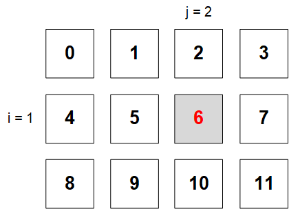
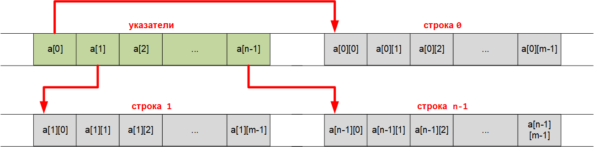
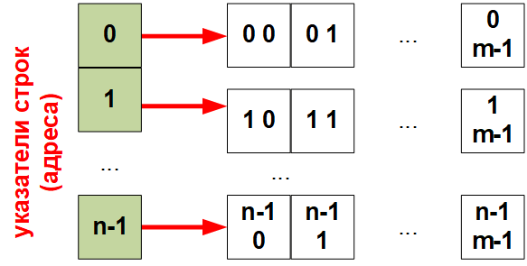

# Динамическое выделение памяти

Очень часто возникают задачи обработки массивов данных, размерность которых заранее неизвестна. В этом случае возможно использование одного из двух подходов:

выделение памяти под статический массив, содержащий максимально возможное число элементов, однако в этом случае память расходуется не рационально;
динамическое выделение памяти для хранение массива данных.
Для использования функций динамического выделения памяти необходимо описать указатель, представляющий собой начальный адрес хранения элементов массива.

>int *p; // указатель на тип int

Начальный адрес статического массива определяется компилятором в момент его объявления и не может быть изменен.

Для динамического массива начальный адрес присваивается объявленному указателю на массив в процессе выполнения программы.

## Стандартные функции динамического выделения памяти
Функции динамического выделения памяти находят в оперативной памяти непрерывный участок требуемой длины и возвращают начальный адрес этого участка.

Функции динамического распределения памяти:

 
>void* malloc(РазмерМассиваВБайтах);
>void* calloc(ЧислоЭлементов, РазмерЭлементаВБайтах);

Для использования функций динамического распределения памяти необходимо подключение библиотеки <malloc.h>:
>#include <alloc.h>

Поскольку обе представленные функции в качестве возвращаемого значения имеют указатель на пустой тип void, требуется явное приведение типа возвращаемого значения.

Для определения размера массива в байтах, используемого в качестве аргумента функции malloc() требуется количество элементов умножить на размер одного элемента. Поскольку элементами массива могут быть как данные простых типов, так и составных типов (например, структуры), для точного определения размера элемента в общем случае рекомендуется использование функции

>int sizeof(тип);

которая определяет количество байт, занимаемое элементом указанного типа.

Память, динамически выделенная с использованием функций calloc(), malloc(), может быть освобождена с использованием функции

>free(указатель);

«Правилом хорошего тона» в программировании является освобождение динамически выделенной памяти в случае отсутствия ее дальнейшего использования. Однако если динамически выделенная память не освобождается явным образом, она будет освобождена по завершении выполнения программы.

## Динамическое выделение памяти для одномерных массивов
Форма обращения к элементам массива с помощью указателей имеет следующий вид:
```
 int a[10], *p; // описываем статический массив и указатель
int b;
p = a; // присваиваем указателю начальный адрес массива
… // ввод элементов массива
b = *p; // b = a[0];
b = *(p+i) // b = a[i];
```
Пример: Организация динамического одномерного массива и ввод его элементов.
```
#define _CRT_SECURE_NO_WARNINGS
#include <stdio.h>
#include <malloc.h>
#include <stdlib.h>
int main()
{
  int* a; // указатель на массив
  int i, n;
  system("chcp 1251");
  system("cls");
  printf("Введите размер массива: ");
  scanf("%d", &n);
  // Выделение памяти
  a = (int*)malloc(n * sizeof(int));
  // Ввод элементов массива
  for (i = 0; i < n; i++)
  {
    printf("a[%d] = ", i);
    scanf("%d", &a[i]);
  }
  // Вывод элементов массива
  for (i = 0; i < n; i++)
    printf("%d ", a[i]);
  free(a);
  getchar();  getchar();
  return 0;
}
```
```
Введите размер массива: 5
а[0] = 4
а[1] = 7
а[2] = 3
а[3] = 2
а[4] = 1
4	7 3 2 1
```

## Динамическое выделение памяти для двумерных массивов
Пусть требуется разместить в динамической памяти матрицу, содержащую n строк и m столбцов. Двумерная матрица будет располагаться в оперативной памяти в форме ленты, состоящей из элементов строк. При этом индекс любого элемента двумерной матрицы можно получить по формуле

>**index = i*m+j;**

где i — номер текущей строки; j — номер текущего столбца.

Рассмотрим матрицу 3×4 



Индекс выделенного элемента определится как

>**index = 1*4+2=6**

Объем памяти, требуемый для размещения двумерного массива, определится как

>**n·m·(размер элемента)**

Однако поскольку при таком объявлении компилятору явно не указывается количество элементов в строке и столбце двумерного массива, традиционное обращение к элементу путем указания индекса строки и индекса столбца является некорректным:

**a[j]** — некорректно.

Правильное обращение к элементу с использованием указателя будет выглядеть как

>*(p+i*m+j),

где

p — указатель на массив,
m — количество столбцов,
i — индекс строки,
j — индекс столбца.
Пример: Ввод и вывод значений динамического двумерного массива


```
#define _CRT_SECURE_NO_WARNINGS
#include <stdio.h>
#include <malloc.h>
#include <stdlib.h>
int main()
{
  int* a; // указатель на массив
  int i, j, n, m;
  system("chcp 1251");
  system("cls");
  printf("Введите количество строк: ");
  scanf("%d", &n);
  printf("Введите количество столбцов: ");
  scanf("%d", &m);
  // Выделение памяти
  a = (int*)malloc(n * m * sizeof(int));
  // Ввод элементов массива
  for (i = 0; i < n; i++) // цикл по строкам
  {
    for (j = 0; j < m; j++) // цикл по столбцам
    {
      printf("a[%d][%d] = ", i, j);
      scanf("%d", (a + i * m + j));
    }
  }
  // Вывод элементов массива
  for (i = 0; i < n; i++) // цикл по строкам
  {
    for (j = 0; j < m; j++) // цикл по столбцам
    {
      printf("%5d ", *(a + i * m + j)); // 5 знакомест под элемент массива
    }
    printf("\n");
  }
  free(a);
  getchar();  getchar();
  return 0;
}
```
```
Введите количество строк: 3
Введите количество столбцов: 4
а[0][0] = 1
а[0][1] = 2
а[0][2] = 3
а[0][3] = 4
а[1][0] = 5
а[1][1] = 6
а[1][2] = 7
а[1][3] = 8
а[2][0] = 9
а[2][1] = 10
а[2][2] = 11
а[2][3] = 12
1  2	3  4
5  6	7  8
9	10 11	12
```

Возможен также другой способ динамического выделения памяти под двумерный массив — с использованием массива указателей. Для этого необходимо:

выделить блок оперативной памяти под массив указателей;
выделить блоки оперативной памяти под одномерные массивы, представляющие собой строки искомой матрицы;
записать адреса строк в массив указателей.



Графически такой способ выделения памяти можно представить следующим образом.


При таком способе выделения памяти компилятору явно указано количество строк и количество столбцов в массиве.

Пример:


```
#define _CRT_SECURE_NO_WARNINGS
#include <stdio.h>
#include <malloc.h>
#include <stdlib.h>
int main()
{
  int** a; // указатель на указатель на строку элементов
  int i, j, n, m;
  system("chcp 1251");
  system("cls");
  printf("Введите количество строк: ");
  scanf("%d", &n);
  printf("Введите количество столбцов: ");
  scanf("%d", &m);
  // Выделение памяти под указатели на строки
  a = (int**)malloc(n * sizeof(int*));
  // Ввод элементов массива
  for (i = 0; i < n; i++) // цикл по строкам
  {
    // Выделение памяти под хранение строк
    a[i] = (int*)malloc(m * sizeof(int));
    for (j = 0; j < m; j++) // цикл по столбцам
    {
      printf("a[%d][%d] = ", i, j);
      scanf("%d", &a[i][j]);
    }
  }
  // Вывод элементов массива
  for (i = 0; i < n; i++) // цикл по строкам
  {
    for (j = 0; j < m; j++) // цикл по столбцам
    {
      printf("%5d ", a[i][j]); // 5 знакомест под элемент массива
    }
    printf("\n");
  }
  // Очистка памяти
  for (i = 0; i < n; i++) // цикл по строкам
    free(a[i]);  // освобождение памяти под строку
  free(a);
  getchar();  getchar();
  return 0;
}
```


Результат выполнения программы аналогичен предыдущему случаю.

## Свободные массивы
С помощью динамического выделения памяти под указатели строк можно размещать свободные массивы.

Свободным называется двухмерный массив (матрица), размер строк которого может быть различным.

Преимущество использования свободного массива заключается в том, что не требуется отводить память компьютера с запасом для размещения строки максимально возможной длины. Фактически свободный массив представляет собой одномерный массив указателей на одномерные массивы данных.

Для размещения в оперативной памяти матрицы со строками разной длины необходимо ввести дополнительный массив m, в котором будут храниться размеры строк.

Пример: Свободный массив
```
#define _CRT_SECURE_NO_WARNINGS
#include <stdio.h>
#include <stdlib.h>
int main()
{
  int** a;
  int i, j, n, * m;
  system("chcp 1251");
  system("cls");
  printf("Введите количество строк: ");
  scanf("%d", &n);
  a = (int**)malloc(n * sizeof(int*));
  m = (int*)malloc(n * sizeof(int)); // массив кол-ва элеменов в строках массива a
  // Ввод элементов массива
  for (i = 0; i < n; i++)
  {
    printf("Введите количество столбцов строки %d: ", i);
    scanf("%d", &m[i]);
    a[i] = (int*)malloc(m[i] * sizeof(int));
    for (j = 0; j < m[i]; j++) {
      printf("a[%d][%d]= ", i, j);
      scanf("%d", &a[i][j]);
    }
  }
  // Вывод элементов массива
  for (i = 0; i < n; i++)
  {
    for (j = 0; j < m[i]; j++)
    {
      printf("%3d ", a[i][j]);
    }
    printf("\n");
  }
  // Освобождение памяти
  for (i = 0; i < n; i++)
  {
    free(a[i]);
  }
  free(a);
  free(m);
  getchar(); getchar();
  return 0;
}
```
```
Введите количество строк: 3
Введите количество столбцов строки 0: 10
а[0][0]= 1 
а[0][1]= 2
а[0][2]= 3
а[0][3]= 4
а[0][4]= 5
а[0][5]= 6
а[0][6]= 7
а[0][7]= 8
а[0][8]= 9
а[0][9]= 10
Введите количество столбцов строки 1: 2
а[1][0]= 11
а[1][1]= 12
Введите количество столбцов строки 2: 5
а[2][0]= 13
а[2][1]= 14
а[2][2]= 15
а[2][3]= 16
а[2][4]= 17
1 2 3 4 5 6 7 8 9 10
11 12
13 14 15 16 17
```

## Перераспределение памяти
Если размер выделяемой памяти нельзя задать заранее, например при вводе последовательности значений до определенной команды, то для увеличения размера массива при вводе следующего значения необходимо выполнить следующие действия:

Выделить блок памяти размерности n+1 (на 1 больше текущего размера массива)
Скопировать все значения, хранящиеся в массиве во вновь выделенную область памяти
Освободить память, выделенную ранее для хранения массива
Переместить указатель начала массива на начало вновь выделенной области памяти
Дополнить массив последним введенным значением
Все перечисленные выше действия (кроме последнего) выполняет функция

> void* realloc (void* ptr, size_t size);

**ptr** — указатель на блок ранее выделенной памяти функциями malloc(), calloc() или realloc() для перемещения в новое место. Если этот параметр равен NULL, то выделяется новый блок, и функция возвращает на него указатель.
**size** — новый размер, в байтах, выделяемого блока памяти. Если size = 0, ранее выделенная память освобождается и функция возвращает нулевой указатель, ptr устанавливается в NULL.
Размер блока памяти, на который ссылается параметр ptr изменяется на size байтов. Блок памяти может уменьшаться или увеличиваться в размере. Содержимое блока памяти сохраняется даже если новый блок имеет меньший размер, чем старый. Но отбрасываются те данные, которые выходят за рамки нового блока. Если новый блок памяти больше старого, то содержимое вновь выделенной памяти будет неопределенным.

Пример: Выделить память для ввода массива целых чисел. После ввода каждого значения задавать вопрос о вводе следующего значения.
```
#define _CRT_SECURE_NO_WARNINGS
#include <stdio.h>
#include <malloc.h>
int main()
{
  int* a = NULL, i = 0, elem;
  char c;
  do {
    printf("a[%d]= ", i);
    scanf("%d", &elem);
    a = (int*)realloc(a, (i + 1) * sizeof(int));
    a[i] = elem;
    i++;
    getchar();
    printf("Next (y/n)? ");
    c = getchar();
  } while (c == 'y');
  for (int j = 0; j < i; j++)
    printf("%d ", a[j]);
  if (i > 2) i -= 2;
  printf("\n");
  a = (int*)realloc(a, i * sizeof(int)); // уменьшение размера массива на 2
  for (int j = 0; j < i; j++)
    printf("%d ", a[j]);
  getchar(); getchar();
  return 0;
}
```