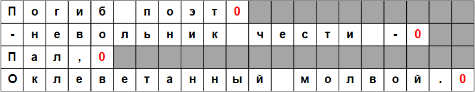

# Функции обработки строк

В программе строки могут определяться следующим образом:

* как строковые константы;
* как массивы символов;
* через указатель на символьный тип;
* как массивы строк.
Кроме того, должно быть предусмотрено выделение памяти для хранения строки.

Любая последовательность символов, заключенная в двойные кавычки "", рассматривается как строковая константа.

Для корректного вывода любая строка должна заканчиваться нуль-символом '\0', целочисленное значение которого равно 0. При объявлении строковой константы нуль-символ добавляется к ней автоматически. Так, последовательность символов, представляющая собой строковую константу, будет размещена в оперативной памяти компьютера, включая нулевой байт.

Под хранение строки выделяются последовательно идущие ячейки оперативной памяти. Таким образом, строка представляет собой массив символов. Для хранения кода каждого символа строки отводится 1 байт.

Для помещения в строковую константу некоторых служебных символов используются символьные комбинации. Так, если необходимо включить в строку символ двойной кавычки, ему должен предшествовать символ "обратный слеш": '\"'.

Строковые константы размещаются в статической памяти. Начальный адрес последовательности символов в двойных кавычках трактуется как адрес строки. Строковые константы часто используются для осуществления диалога с пользователем в таких функциях, как printf().

При определении массива символов необходимо сообщить компилятору требуемый размер памяти.

>char m[82];
Компилятор также может самостоятельно определить размер массива символов, если инициализация массива задана при объявлении строковой константой:

 
>char m2[]="Горные вершины спят во тьме ночной.";

>char m3[]={'Т','и','х','и','е',' ','д','о','л','и','н','ы',' ','п','о','л','н','ы',' ','с','в','е','ж','е','й',' ','м','г','л','о','й','\0'};

В этом случае имена m2 и m3 являются указателями на первые элементы массивов:

* m2        эквивалентно &m2[0]
* m2[0]     эквивалентно 'Г'
* m2[1]     эквивалентно 'o'
* m3        эквивалентно &m3[0]
* m3[2]     эквивалентно 'x'

При объявлении массива символов и инициализации его строковой константой можно явно указать размер массива, но указанный размер массива должен быть больше, чем размер инициализирующей строковой константы:

> char m2[80]="Горные вершины спят во тьме ночной.";

Для задания строки можно использовать указатель на символьный тип.
> char *m4;

В этом случае объявление массива переменной m4 может быть присвоен адрес массива:
>m4 = m3;
>*m4       эквивалентно m3[0]=‘Т’
>*(m4+1)   эквивалентно m3[1]=‘и’

Здесь m3 является константой-указателем. Нельзя изменить m3, так как это означало бы изменение положения (адреса) массива в памяти, в отличие от m4.

Для указателя можно использовать операцию увеличения (перемещения на следующий символ):
>m4++;
>char m[82];

Компилятор также может самостоятельно определить размер массива символов, если инициализация массива задана при объявлении строковой константой:

>char m2[]="Горные вершины спят во тьме ночной.";
>char m3[]={'Т','и','х','и','е',' ','д','о','л','и','н','ы',' ','п','о','л','н','ы',' ','с','в','е','ж','е','й',' ','м','г','л','о','й','\0'};

В этом случае имена m2 и m3 являются указателями на первые элементы массивов:

* m2        эквивалентно &m2[0]
* m2[0]     эквивалентно 'Г'
* m2[1]     эквивалентно 'o'
* m3        эквивалентно &m3[0]
* m3[2]     эквивалентно 'x'

При объявлении массива символов и инициализации его строковой константой можно явно указать размер массива, но указанный размер массива должен быть больше, чем размер инициализирующей строковой константы:

> char m2[80]="Горные вершины спят во тьме ночной.";

Для задания строки можно использовать указатель на символьный тип.
> char *m4;

В этом случае объявление массива переменной m4 может быть присвоен адрес массива:

>m4 = m3;
>*m4       эквивалентно m3[0]='Т'
>*(m4+1)   эквивалентно m3[1]='и'
Здесь m3 является константой-указателем. Нельзя изменить m3, так как это означало бы изменение положения (адреса) массива в памяти, в отличие от m4.

Для указателя можно использовать операцию увеличения (перемещения на следующий символ):
>m4++;

Массивы символьных строк
Иногда в программах возникает необходимость описание массива символьных строк. В этом случае можно использовать индекс строки для доступа к нескольким разным строкам.

 
```
char *poet[4] = {"Погиб поэт!", "- невольник чести -",
"Пал," , "оклеветанный молвой."};
```
В этом случае poet является массивом, состоящим из четырех указателей на символьные строки. Каждая строка символов представляет собой символьный массив, поэтому имеется четыре указателя на массивы. Указатель poet[0] ссылается на первую строку:
*poet[0] эквивалентно 'П', *poet[l] эквивалентно '-'.

Инициализация выполняется по правилам, определенным для массивов. Тексты в кавычках эквивалентны инициализации каждой строки в массиве. Запятая разделяет соседние последовательности. Кроме того, можно явно задавать размер строк символов, используя описание, подобное такому:
>char poet[4][23];

Разница заключается в том, что такая форма задает «прямоугольный» массив, в котором все строки имеют одинаковую длину.


Основные функции стандартной библиотеки string.h
Основные функции стандартной библиотеки string.h приведены в таблице.

|                  Функция                 |                                                      Описание                                                     |
|:----------------------------------------:|:-----------------------------------------------------------------------------------------------------------------:|
| char *strcat(char *s1, char *s2)         | присоединяет s2 к s1, возвращает s1                                                                               |
| char *strncat(char *s1, char *s2, int n) | присоединяет не более n символов s2 к s1, завершает строку символом '\0', возвращает s1                           |
| char *strсpy(char *s1, char *s2)         | копирует строку s2 в строку s1, включая '\0', возвращает s1                                                       |
| char *strncpy(char *s1, char *s2, int n) | копирует не более n символов строки s2 в строку s1, возвращает s1;                                                |
| int strcmp(char *s1, char *s2)           | сравнивает s1 и s2, возвращает значение 0, если строки эквивалентны                                               |
| int strncmp(char *s1, char *s2, int n)   | сравнивает не более n символов строк s1 и s2, возвращает значение 0, если начальные n символов строк эквивалентны |
| int strlen(char *s)                      | возвращает количество символов в строке s                                                                         |
| char *strset(char *s, char c)            | заполняет строку s символами, код которых равен значению c, возвращает указатель на строку s                      |
| char *strnset(char *s, char c, int n)    | заменяет первые n символов строки s символами, код которых равен c, возвращает указатель на строку s              |

Пример использования функций

```
#define _CRT_SECURE_NO_WARNINGS
#include <stdio.h>
#include <stdlib.h>
#include <string.h>
int main() {
    char m1[80] = "Первая строка";
    char m2[80] = "Вторая строка";
    char m3[80];
    system("chcp 1251");
    system("cls");
    strncpy(m3, m1, 6);  // не добавляет '\0' в конце строки
    puts("Результат strncpy(m3, m1, 6)");
    puts(m3);
    strcpy(m3, m1);
    puts("Результат strcpy(m3, m1)");
    puts(m3);
    puts("Результат strcmp(m3, m1) равен");
    printf("%d", strcmp(m3, m1));
    strncat(m3, m2, 5);
    puts("Результат strncat(m3, m2, 5)");
    puts(m3);
    strcat(m3, m2);
    puts("Результат strcat(m3, m2)");
    puts(m3);
    puts("Количество символов в строке m1 равно  strlen(m1) : ");
    printf("%d\n", strlen(m1));
    _strnset(m3, 'f', 7);
    puts("Результат strnset(m3, 'f', 7)");
    puts(m3);
    _strset(m3, 'k');
    puts("Результат strnset(m3, 'k')");
    puts(m3);
    getchar();
    return 0;
}
```
```
Результат strncpy(m3, ml, 6)
Первая IWIMIWIMIWIMIWIW^^
МРМ4МРМ4М№^
Результат strcpy(m3, ml)
Первая строка
Результат strcmp(m3, ml) равен
©Результат strncat(m3, m2, 5)
Первая строкаВтора
Результат strcat(m3, m2)
Первая строкаВтораВторая строка
Количество символов в строке ml равно strlen(ml) :
13
Результат strnset(m3, 'f, 7)
fffffffcTpoKaBTopaBTopafl строка
Результат strnset(m3, 'k')
kkkkkkkkkkkkkkkkkkkkkkkkkkkkkkk
```