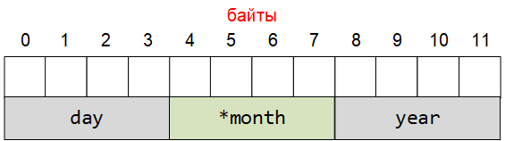
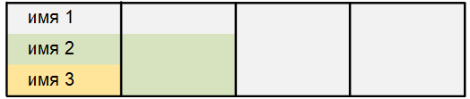
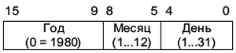

# Сложные типы данных

**Структура** — это объединение нескольких объектов, возможно, различного типа под одним именем, которое является типом структуры. В качестве объектов могут выступать переменные, массивы, указатели и другие структуры.

Структуры позволяют трактовать группу связанных между собой объектов не как множество отдельных элементов, а как единое целое. Структура представляет собой сложный тип данных, составленный из простых типов.

Общая форма объявления структуры:
```
 struct ИмяСтруктуры
{
  тип ИмяЭлемента1;
  тип ИмяЭлемента2;
  . . .
  тип ИмяЭлементаn;
};
```
После закрывающей фигурной скобки } в объявлении структуры обязательно ставится точка с запятой.

**Пример** объявления структуры
```
 struct date
{
  int day;     // 4 байта
  char *month; // 4 байта
  int year;    // 4 байта
};
```

Поля структуры располагаются в памяти в том порядке, в котором они объявлены:


В указанном примере структура date занимает в памяти 12 байт. Кроме того, указатель *month при инициализации будет началом текстовой строки с названием месяца, размещенной в памяти.

При объявлении структур, их разрешается вкладывать одну в другую.

Пример

```
 struct persone
{
  char lastname[20];   // фамилия
  char firstname[20]; // имя
  struct date bd;     // дата рождения
};
```
## Инициализация полей структуры
Инициализация полей структуры может осуществляться двумя способами:

присваивание значений элементам структуры в процессе объявления переменной, относящейся к типу структуры;
присваивание начальных значений элементам структуры с использованием функций ввода (например, scanf()).
В первом способе инициализация осуществляется по следующей форме:

>struct ИмяСтруктуры ИмяПеременной={ЗначениеЭлемента1, ЗначениеЭлемента_2, . . . , ЗначениеЭлементаn};

Пример
>struct date bd={8,"июня", 1978};

Имя элемента структуры является составным. Для обращения к элементу структуры нужно указать имя структуры и имя  самого элемента. Они разделяются точкой:

>ИмяПеременной.ИмяЭлементаСтруктуры

>printf("%d %s %d",bd.day, bd.month, bd.year);

Второй способ инициализации объектов языка Си с использованием функций ввода-вывода.

Пример
```
#define _CRT_SECURE_NO_WARNINGS
#include <stdio.h>
#include <stdlib.h>
struct date 
{
  int day;
  char month[20];
  int year;
};
struct persone 
{
  char firstname[20];
  char lastname[20];
  struct date bd;
};
int main() 
{
  system("chcp 1251");
  system("cls");
  struct persone p;
  printf("Введите имя : ");
  scanf("%s", p.firstname);
  printf("Введите фамилию : ");
  scanf("%s", p.lastname);
  printf("Введите дату рождения\nЧисло: ");
  scanf("%d", &p.bd.day);
  printf("Месяц: ");
  scanf("%s", p.bd.month);
  printf("Год: ");
  scanf("%d", &p.bd.year);
  printf("\nВы ввели : %s %s, дата рождения %d %s %d года",
    p.firstname, p.lastname, p.bd.day, p.bd.month, p.bd.year);
  getchar(); getchar();
  return 0;
}
```
```
Введите имя : Иван
Введите фамилию : Петров
Введите дату рождения
Число: 1
Месяц: января
Год: 2000

Вы ввели : Иван Петров, дата рождения 1 января 2000 года
```
Имя структурной переменной может быть указано при объявлении структуры. В этом случае оно размещается после закрывающей фигурной скобки }. Область видимости такой структурной переменной будет определяться местом описания структуры.

 
 
 
```
 struct complex_type  // имя структуры
{
  double real;
  double imag;
} number;    // имя структурной переменной
```
Поля приведенной структурной переменной: number.real, number.imag .

## Объединения
Объединениями называют сложный тип данных, позволяющий размещать в одном и том же месте оперативной памяти данные различных типов.

Размер оперативной памяти, требуемый для хранения объединений, определяется размером памяти, необходимым для размещения данных того типа, который требует максимального количества байт.

Когда используется элемент меньшей длины, чем наиболее длинный элемент объединения, то этот элемент использует только часть отведенной памяти. Все элементы объединения хранятся в одной и той же области памяти, начиная с одного адреса.

Общая форма объявления объединения

 
 
 
 
 
```
 union ИмяОбъединения
{
  тип ИмяОбъекта1;
  тип ИмяОбъекта2;
  . . .
  тип ИмяОбъектаn;
};
```


Объединения применяются для следующих целей:

для инициализации объекта, если в каждый момент времени только один из многих объектов является активным;
для интерпретации представления одного типа данных в виде другого типа.
Например, удобно использовать объединения, когда необходимо вещественное число типа float представить в виде совокупности байтов.


```
#define _CRT_SECURE_NO_WARNINGS
#include <stdio.h>
#include <stdlib.h>
union types
{
  float f;
  unsigned char b[4];
};
int main()
{
  types value;
  printf("N = ");
  scanf("%f", &value.f);
  printf("%f = %x %x %x %x", value.f, value.b[0], value.b[1], value.b[2], value.b[3]);
  getchar();
  getchar();
  return 0;
}
```
```
N = 15.3
15.300000 = cd cc 74 41
```
Пример Поменять местами два младших байта во введенном числе


```
#define _CRT_SECURE_NO_WARNINGS
#include <stdio.h>
#include <stdlib.h>
int main() 
{
  char temp;
  system("chcp 1251");
  system("cls");
  union
  {
    unsigned char p[2];
    unsigned int t;
  } type;
  printf("Введите число : ");
  scanf("%d", &type.t);
  printf("%d = %x шестн.\n", type.t, type.t);
  // Замена байтов
  temp = type.p[0];
  type.p[0] = type.p[1];
  type.p[1] = temp;
  printf("Поменяли местами байты, получили\n");
  printf("%d = %x шестн.\n", type.t, type.t);
  getchar(); getchar();
  return 0;
}
```
```
Введите число : 450
450 = 1с2 шести.
Поменяли местами байты, получили
49665 = с201 шести.
```

## Битовые поля
Используя структуры, можно упаковать целочисленные компоненты еще более плотно, чем это было сделано с использованием массива.

Набор разрядов целого числа можно разбить на битовые поля, каждое из которых выделяется для определенной переменной. При работе с битовыми полями количество битов, выделяемое для хранения каждого поля отделяется от имени двоеточием

>тип имя: КоличествоБит
При работе с битовыми полями нужно внимательно следить за тем, чтобы значение переменной не потребовало памяти больше, чем под неё выделено.

Пример Разработать программу, осуществляющую упаковку даты в формат




```
#define _CRT_SECURE_NO_WARNINGS
#include <stdio.h>
#include <stdlib.h>
#define YEAR0 1980
struct date
{
  unsigned short day : 5;
  unsigned short month : 4;
  unsigned short year : 7;
};
int main() 
{
  struct date today;
  system("chcp 1251");
  system("cls");
  today.day = 16;
  today.month = 12;
  today.year = 2013 - YEAR0; //today.year = 33
  printf("\n Сегодня %u.%u.%u \n", today.day, today.month, today.year + YEAR0);
  printf("\n Размер структуры today : %d байт", sizeof(today));
  printf("\n Значение элемента today = %hu = %hx шестн.", today, today);
  getchar();
  return 0;
}
```
```
Сегодня 16.12.2013
Размер структуры today : 2 байт
Значение элемента today = 17296 = 4390 шести.
```

## Массивы структур
Работа с массивами структур аналогична работе со статическими массивами других типов данных.

Пример Библиотека из 3 книг


```
#include <stdio.h>
#include <stdlib.h>
struct book
{
  char title[15];
  char author[15];
  int value;
};
int main()
{
  struct book libry[3];
  int i;
  system("chcp 1251");
  system("cls");
  for (i = 0; i<3; i++)
  {
    printf("Введите название %d книги : ", i + 1);
    gets_s(libry[i].title);
    printf("Введите автора %d книги : ", i + 1);
    gets_s(libry[i].author);
    printf("Введите цену %d книги : ", i + 1);
    scanf_s("%d", &libry[i].value);
    getchar();
  }
  for (i = 0; i<3; i++)
  {
    printf("\n %d. %s ", i + 1, libry[i].author);
    printf("%s %d", libry[i].title, libry[i].value);
  }
  getchar();
  return 0;
}
```
```
Введите название 1 книги : Сказки
Введите автора 1 книги : Пушкин
Введите цену 1 книги : 230
Введите название 2 книги : Басни
Введите автора 2 книги : Крылов
Введите цену 2 книги : 450
Введите название 3 книги : Стихи
Введите автора 3 книги : Барто
Введите цену 3 книги : 36

1.	Пушкин Сказки 230
2.	Крылов Басни 450
3.	Барто Стихи 36
```
## Указатели на структуры
Доступ к элементам структуры или объединения можно осуществить с помощью указателей. Для этого необходимо инициализировать указатель адресом структуры или объединения.

Для организации работы с массивом можно использовать указатель. При этом обращение к полям структуры через указатель будет выглядеть как:

>указатель->поле
или
>(*указатель).поле

**указатель** — указатель на структуру или объединение;
**поле**  — поле структуры или объединения;
Динамическое выделение памяти для структур
Динамически выделять память под массив структур необходимо в том случае, если заранее неизвестен размер массива. Для определения размера структуры в байтах используется операция sizeof(ИмяСтруктуры).

Пример Библиотека из 3 книг
```
#include <stdio.h>
#include <stdlib.h>
#include <malloc.h>
struct book
{
  char title[15];
  char author[15];
  int value;
};
int main()
{
  struct book* lib;
  int i;
  system("chcp 1251");
  system("cls");
  lib = (struct book*)malloc(3 * sizeof(struct book));
  for (i = 0; i < 3; i++)
  {
    printf("Введите название %d книги : ", i + 1);
    gets_s((lib + i)->title);
    printf("Введите автора %d книги : ", i + 1);
    gets_s((lib + i)->author);
    printf("Введите цену %d книги : ", i + 1);
    scanf_s("%d", &(lib + i)->value);
    getchar();
  }
  for (i = 0; i < 3; i++)
  {
    printf("\n %d. %s ", i + 1, (lib + i)->author);
    printf("%s %d", (lib + i)->title, (lib + i)->value);
  }
  getchar();
  return 0;
}
```
Результат выполнения аналогичен предыдущему решению.