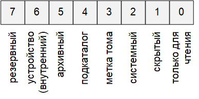

# Работа с файлами

Для удобства обращения информация в запоминающих устройствах хранится в виде файлов.

**Файл** – именованная область внешней памяти, выделенная для хранения массива данных. Данные, содержащиеся в файлах, имеют самый разнообразный характер: программы на алгоритмическом или машинном языке; исходные данные для работы программ или результаты выполнения программ; произвольные тексты; графические изображения и т. п.

**Каталог** (папка, директория) – именованная совокупность байтов на носителе информации, содержащая название подкаталогов и файлов, используется в файловой системе для упрощения организации файлов.

**Файловой системой** называется функциональная часть операционной системы, обеспечивающая выполнение операций над файлами. Примерами файловых систем являются FAT (FAT – File Allocation Table, таблица размещения файлов), NTFS, UDF (используется на компакт-дисках).

Существуют три основные версии FAT: FAT12, FAT16 и FAT32. Они отличаются разрядностью записей в дисковой структуре, т.е. количеством бит, отведённых для хранения номера кластера. FAT12 применяется в основном для дискет (до 4 кбайт), FAT16 – для дисков малого объёма, FAT32 – для FLASH-накопителей большой емкости (до 32 Гбайт).

## Структура файловой системы FAT32
Устройства внешней памяти в системе FAT32 имеют не байтовую, а блочную адресацию. Запись информации в устройство внешней памяти осуществляется блоками или секторами.

**Сектор** – минимальная адресуемая единица хранения информации на внешних запоминающих устройствах. Как правило, размер сектора фиксирован и составляет 512 байт. Для увеличения адресного пространства устройств внешней памяти сектора объединяют в группы, называемые кластерами.

**Кластер** – объединение нескольких секторов, которое может рассматриваться как самостоятельная единица, обладающая определёнными свойствами. Основным свойством кластера является его размер, измеряемый в количестве секторов или количестве байт.
Файловая система FAT32 имеет следующую структуру.

|       Загрузочный сектор       |          512 байт          |
|:------------------------------:|:--------------------------:|
|   Информация файловой системы  |          512 байт          |
|        Резервные сектора       |                            |
| Таблица размещения файлов FAT1 | Число кластеров * 4 (байт) |
| Таблица размещения файлов FAT2 | Число кластеров * 4 (байт) |
|        Корневой каталог        |          1 кластер         |
|          Массив данных         |                            |

Нумерация кластеров, используемых для записи файлов, ведется с 2. Как правило, кластер №2 используется корневым каталогом, а начиная с кластера №3 хранится массив данных. Сектора, используемые для хранения информации, представленной выше корневого каталога, в кластеры не объединяются.

Минимальный размер файла, занимаемый на диске, соответствует 1 кластеру.

Загрузочный сектор начинается следующей информацией:

EB 58 90 – безусловный переход и сигнатура;
4D 53 44 4F 53 35 2E 30 MSDOS5.0;
00 02 – количество байт в секторе (обычно 512);
1 байт – количество секторов в кластере;
2 байта – количество резервных секторов.
Кроме того, загрузочный сектор содержит следующую важную информацию:

0x10 (1 байт) – количество таблиц FAT (обычно 2);
0x20 (4 байта) – количество секторов на диске;
0x2С (4 байта) – номер кластера корневого каталога;
0x47 (11 байт) – метка тома;
0x1FE (2 байта) – сигнатура загрузочного сектора (55 AA).
Сектор информации файловой системы содержит:

0x00 (4 байта) – сигнатура (52 52 61 41);
0x1E4 (4 байта) – сигнатура (72 72 41 61);
0x1E8 (4 байта) – количество свободных кластеров, -1 если не известно;
0x1EС (4 байта) – номер последнего записанного кластера;
0x1FE (2 байта) – сигнатура (55 AA).
Таблица FAT содержит информацию о состоянии каждого кластера на диске. Младшие 2 байт таблицы FAT хранят F8 FF FF 0F FF FF FF FF (что соответствует состоянию кластеров 0 и 1, физически отсутствующих). Далее состояние каждого кластера содержит номер кластера, в котором продолжается текущий файл или следующую информацию:

00 00 00 00 – кластер свободен;
FF FF FF 0F – конец текущего файла.
Корневой каталог содержит набор 32-битных записей информации о каждом файле, содержащих следующую информацию:

8 байт – имя файла;
3 байта – расширение файла;
1 байт – атрибуты файла;



1 байт – зарезервирован;
1 байт – время создания (миллисекунды) (число от 0 до 199);
2 байта – время создания (с точностью до 2с):


2 байта – дата создания:


2 байта – дата последнего доступа;
2 байта – старшие 2 байта начального кластера;
2 байта – время последней модификации;
2 байта – дата последней модификации;
2 байта – младшие 2 байта начального кластера;
4 байта – размер файла (в байтах).
В случае работы с длинными именами файлов (включая русские имена) кодировка имени файла производится в системе кодировки UTF-8. При этого для кодирования каждого символа отводится 2 байта. При этом имя файла записывается в виде следующей структуры:

1 байт последовательности;
10 байт содержат младшие 5 символов имени файла;
1 байт атрибут;
1 байт резервный;
1 байт – контрольная сумма имени DOS;
12 байт содержат младшие 3 символа имени файла;
2 байта – номер первого кластера;
остальные символы длинного имени.
Далее следует запись, включающая имя файла в формате 8.3 в обычном формате.

## Работа с файлами в языке Си
Для программиста открытый файл представляется как последовательность считываемых или записываемых данных. При открытии файла с ним связывается поток ввода-вывода. Выводимая информация записывается в поток, вводимая информация считывается из потока.

Когда поток открывается для ввода-вывода, он связывается со стандартной структурой типа FILE, которая определена в stdio.h. Структура FILE содержит необходимую информацию о файле.

Открытие файла осуществляется с помощью функции fopen(), которая возвращает указатель на структуру типа FILE, который можно использовать для последующих операций с файлом.

> FILE *fopen(name, type);
* name – имя открываемого файла (включая путь),
* type — указатель на строку символов, определяющих способ доступа к файлу:
  * "r" — открыть файл для чтения (файл должен существовать);
  * "w" — открыть пустой файл для записи; если файл существует, то его содержимое теряется;
  * "a" — открыть файл для записи в конец (для добавления); файл создается, если он не существует;
  * "r+" — открыть файл для чтения и записи (файл должен существовать);
  * "w+" — открыть пустой файл для чтения и записи; если файл существует, то его содержимое теряется;
  * "a+" — открыть файл для чтения и дополнения, если файл не существует, то он создаётся.
Возвращаемое значение — указатель на открытый поток. Если обнаружена ошибка, то возвращается значение NULL.

Функция **fclose()** закрывает поток или потоки, связанные с открытыми при помощи функции fopen() файлами. Закрываемый поток определяется аргументом функции fclose().

```
#include <stdio.h>
int main() {
  FILE *fp;
  char name[] = "my.txt";
  if ((fp = fopen(name, "r")) == NULL)
  {
    printf("Не удалось открыть файл");
    getchar();
    return 0;
  }
// открыть файл удалось
...      // требуемые действия над данными
  fclose(fp);
  getchar();
  return 0;
}
```
Чтение символа из файла:

> int fgetc(поток);

Аргументом функции является указатель на поток типа FILE. Функция возвращает код считанного символа. Если достигнут конец файла или возникла ошибка, возвращается константа EOF = (-1).

Запись символа в файл:

> int fputc(символ, поток);

Аргументами функции являются символ и указатель на поток типа FILE. Функция возвращает код считанного символа.

Функции fscanf() и fprintf() аналогичны функциям scanf() и printf(), но работают с файлами данных, и имеют первый аргумент — указатель на файл.

> fscanf(поток, "ФорматВвода", аргументы);
> fprintf(поток, "ФорматВывода", аргументы);

Функции fgets() и fputs() предназначены для ввода-вывода строк, они являются аналогами функций gets() и puts() для работы с файлами.

> fgets(УказательНаСтроку, КоличествоСимволов, поток);

Символы читаются из потока до тех пор, пока не будет прочитан символ новой строки ‘\n’, который включается в строку, или пока не наступит конец потока EOF или не будет прочитано максимальное количество символов. Результат помещается в указатель на строку и заканчивается нуль- символом ‘\0’. Функция возвращает адрес строки.

> fputs(УказательНаСтроку, поток);

Копирует строку в поток с текущей позиции. Завершающий нуль- символ не копируется.

Пример Ввести число и сохранить его в файле s1.txt. Считать число из файла s1.txt, увеличить его на 3 и сохранить в файле s2.txt.

``` 
#define _CRT_SECURE_NO_WARNINGS
#include <stdio.h>
#include <stdlib.h>
int main()
{
  FILE* S1, * S2;
  int x, y;
  system("chcp 1251");
  system("cls");
  printf("Введите число : ");
  scanf("%d", &x);
  S1 = fopen("S1.txt", "w");
  fprintf(S1, "%d", x);
  fclose(S1);
  S1 = fopen("S1.txt", "r");
  S2 = fopen("S2.txt", "w");
  fscanf(S1, "%d", &y);
  y += 3;
  fclose(S1);
  fprintf(S2, "%d\n", y);
  fclose(S2);
  return 0;
}
```
>3
>6

## Перемещение указателя внутри файла
Функция fseek() перемещает указатель позиции в потоке. Устанавливает внутренний указатель положения в файле, в новую позицию, которая определяются путем добавления смещения к исходному положению.

> int fseek( поток, смещение, положение);
* **поток** — указатель на объект типа FILE, идентифицируемый поток.
* **смещение** — количество байт для смещения, относительно некоторого положения указателя.
* **положение** — позиция указателя, относительно которой будет выполняться смещение.
Позиция указателя задается одной из следующих констант, определённых в заголовочном файле stdio.h:

**SEEK_SET**	Начало файла
**SEEK_CUR**	Текущее положение в файле
**SEEK_END**	Конец файла
В случае успеха, функция возвращает нулевое значение.
В противном случае, она возвращает ненулевое значение.

Функция ftell() возвращает значение указателя текущего положения потока. Для бинарных потоков, возвращается значение соответствующее количеству байт от начала файла. В случае успеха, возвращается текущее значение индикатора положения.

Если происходит ошибка, возвращается значение -1.

> long int ftell(поток);
Пример: смещение позиции в файле

```
#define _CRT_SECURE_NO_WARNINGS
#include <stdio.h>
#include <stdlib.h>
int main()
{
  FILE* fp;
  char s[80];
  system("chcp 1251");
  system("cls");
  fp = fopen("S1.txt", "w");
  if (fp == NULL)
  {
    printf("Ошибка открытия файла");
    getchar();
    return 1;
  }
  fputs("Первая строка текста", fp);
  printf("%d", ftell(fp)); // печатаем текущую позицию в файле
  fseek(fp, -4, SEEK_CUR); // смещаемся на 4 байта влево от текущей позиции
  fputs("Вторая строка текста", fp);
  fclose(fp);
  getchar();
  return 0;
}
```
>20
>Первая строка теВторая строка текста