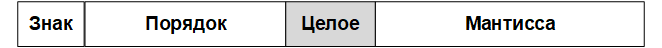
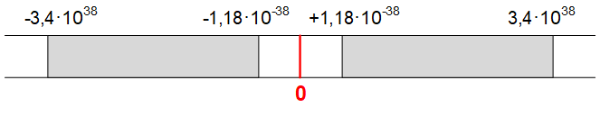
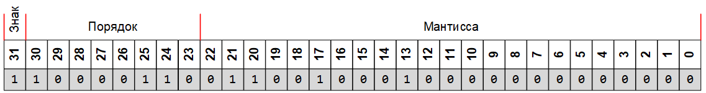

# Типы данных

Тип данных определяет множество значений, набор операций, которые можно применять к таким значениям и способ реализации хранения значений и выполнения операций.

Процесс проверки и накладывания ограничений на типы используемых данных называется контролем типов или типизацией программных данных. Различают следующие виды типизации:

Статическая типизация — контроль типов осуществляется при компиляции.
Динамическая типизация — контроль типов осуществляется во время выполнения.
Язык Си поддерживает статическую типизацию, и типы всех используемых в программе данных должны быть указаны перед ее компиляцией.

Различают простые, составные и прочие типы данных.

Простые данные

Простые данные можно разделить на
* целочисленные
* вещественные
* символьные
* логические

Составные (сложные) данные

* Массив — индексированный набор элементов одного типа.
* Строковый тип — массив, хранящий строку символов.
* Структура — набор различных элементов (полей записи), хранимый как единое целое и предусматривающий доступ к отдельным полям структуры.

Другие типы данных
* Указатель — хранит адрес в памяти компьютера, указывающий на какую-либо информацию, как правило — указатель на переменную.
Программа, написанная на языке Си, оперирует с данными различных типов. Все данные имеют имя и тип. Обращение к данным в программе осуществляется по их именам (идентификаторам).

Идентификатор — это последовательность, содержащая не более 32 символов, среди которых могут быть любые буквы латинского алфавита a — z, A — Z, цифры 0 — 9 и знак подчеркивания (_). Первый символ идентификатора не должен быть цифрой.

Несмотря на то, что допускается имя, имеющее до 32 символов, определяющее значение имеют только первые 8 символов. Помимо имени, все данные имеют тип. Указание типа необходимо для того, чтобы было известно, сколько места в оперативной памяти будет занимать данный объект.

Компилятор языка Си придерживается строгого соответствия прописных и строчных букв в именах идентификаторов и лексем.

TABL
Верно	Неверно
int a = 2, b;
b = a+3;	Int a=2;  // правильно int
INT a=2;
int a = 2, b; b = A + 3; // идентификатор А не объявлен

Пример объявления объектов
 
int n;    // Переменная n целого типа
double a; // Переменная a вещественного типа двойной точности

## Целочисленные данные
Целочисленные данные могут быть представлены в знаковой и беззнаковой форме.

Беззнаковые целые числа представляются в виде последовательности битов в диапазоне от 0 до 2n-1, где n-количество занимаемых битов.

Знаковые целые числа представляются в диапазоне -2n-1…+2n-1-1. При этом старший бит данного отводится под знак числа (0 соответствует положительному числу, 1 – отрицательному).

Основные типы и размеры целочисленных данных:

| Количество бит |     Беззнаковый тип    |    Знаковый тип    |
|:--------------:|:----------------------:|:------------------:|
|        8       | unsigned char 0…255    | char -128…127      |
|       16       | unsigned short 0…65535 | short -32768…32767 |
|       32       | unsigned int           | int                |
|       64       | unsigned long int      | long int           |

## Вещественные данные
Вещественный тип предназначен для представления действительных чисел. Вещественные числа представляются в разрядной сетке машины в нормированной форме.

Нормированная форма числа предполагает наличие одной значащей цифры (не 0) до разделения целой и дробной части. Такое представление умножается на основание системы счисления в соответствующей степени. Например, число 12345,678 в нормированной форме можно представить как

12345,678 = 1,2345678·104

Число 0,009876 в нормированной форме можно представить как

0,009876 = 9,876·10-3

В двоичной системе счисления значащий разряд, стоящий перед разделителем целой и дробной части, может быть равен  только 1. В случае если число нельзя представить в нормированной форме (например, число 0), значащий разряд перед разделителем целой и дробной части равен 0.

Значащие разряды числа, стоящие в нормированной форме после разделителя целой и дробной части, называются мантиссой числа.

В общем случае вещественное число в разрядной сетке вычислительной машины можно представить в виде 4 полей.

* знак — бит, определяющий знак вещественного числа (0 для положительных чисел, 1 — для отрицательных).
* степень — определяет степень 2, на которую требуется умножить число в нормированной форме. Поскольку степень 2 для числа в нормированной форме может быть как положительной, так и отрицательной, нулевой степени 2 в представлении вещественного числа соответствует величина сдвига, которая определяется как 2^n-1, где n — количество разрядов, отводимых для представления степени числа.
* целое — бит, который для нормированных чисел всегда равен 1, поэтому в некоторых представлениях типов этот бит опущен и принимается равным 1.
* мантисса — значащие разряды представления числа, стоящие после разделителя целой и дробной части в нормированной форме.
Различают три основных типа представления вещественных чисел в языке Си:

|              Тип             | Обозначение в Си | Кол-во бит | Биты степени | Мантисса | Сдвиг |
|:----------------------------:|:----------------:|:----------:|:------------:|:--------:|:-----:|
|            простое           |       float      |     32     |     30…23    |   22…0   |  127  |
|       двойной точности       |      double      |     64     |     62…52    |   51…0   |  1023 |
| двойной расширенной точности |    long double   |     80     |     78…64    |   62…0   | 16383 |

Как видно из таблицы, бит целое у типов float и double отсутствует. При этом диапазон представления вещественного числа состоит из двух диапазонов, расположенных симметрично относительно нуля. Например, диапазон представления чисел типа float можно представить в виде:

Пример: представить число -178,125 в 32-разрядной сетке (тип float).

Для представления числа в двоичной системе счисления преобразуем отдельно целую и дробную части:

17810 = 101100102.

0,12510 = 0,0012.

Тогда

178,12510 = 10110010,0012=1,0110010001·2111

Для преобразования в нормированную форму осуществляется сдвиг на 7 разрядов влево).

Для определения степени числа применяем сдвиг:

0111111+00000111 = 10000110.

Таким образом, число -178,125 представится в разрядной сетке как

## Символьный тип
Символьный тип хранит код символа и используется для отображения символов в различных кодировках. Символьные данные задаются в кодах и по сути представляют собой целочисленные значения. Для хранения кодов символов в языке Си используется тип char.

Подробнее о кодировке символов.

## Логический тип
Логический тип применяется в логических операциях, используется при алгоритмических проверках условий и в циклах и имеет два значения:

истина — true
ложь — false
В программе должно быть дано объявление всех используемых данных с указанием их имени и типа. Описание данных должно предшествовать их использованию в программе.